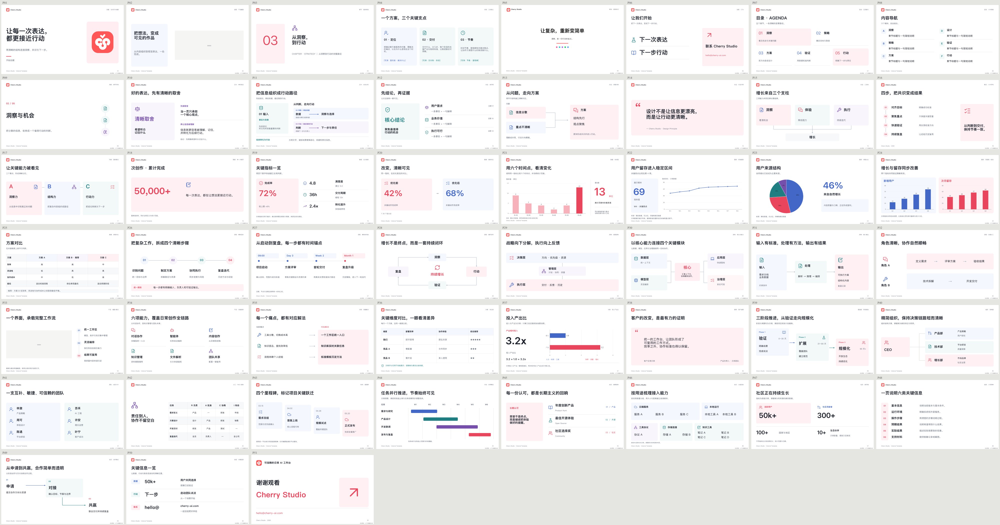

# Feishu PPT Skill

Create and edit native **Lark / Feishu slides** using 51 reusable XML layouts, explicit content bindings, local previews, and automated checks. Cherry Studio is the bundled default theme; adapt the theme and assets when the user requests another brand.

The skill entry point is [SKILL.md](SKILL.md). It handles Feishu presentations, not general posters or `.pptx` export.

The default visual direction is flat, modern and minimal: use proportions, typography, consistent outline icons and soft solid fills to establish hierarchy. Omit outlines when spacing and background color already make the grouping clear. Layouts vary with the content; charts, tables, screenshots and relationship diagrams remain editable native elements where supported. See [design rules](references/theme.md).

## Install

Requires Python **3.10+**. Install into your agent's skill directory using its normal installation workflow, or clone into a local directory for command-line use:

```bash
git clone https://github.com/YinsenWANG/feishu-ppt-skill.git
cd feishu-ppt-skill
python3 -m venv .venv
# macOS/Linux; on Windows use .venv\Scripts\Activate.ps1
. .venv/bin/activate
python3 -m pip install -r requirements.txt
python3 scripts/preflight.py --json
```

Use the same Python interpreter for all scripts. Resource paths are resolved from the installed skill, not a particular home directory. The skill name is now `feishu-ppt-skill`; installations using the previous `cherry-studio-design-language` name should update their invocation/reference to the new name. Cherry templates and assets remain available.

Lark CLI is only needed for actual Feishu operations and official screenshots. Commands below were checked against **CLI 1.0.86**; check your installed version's capabilities before use:

```bash
python3 scripts/preflight.py --check-cli --json
```

This only probes `--version` and `--help`. It does not log in, change profiles, or verify live write behavior. CLI operations and their revision semantics are described in [references/cli-workflow.md](references/cli-workflow.md).

## Quick start

1. Find a suitable layout in [templates/INDEX.md](templates/INDEX.md). Generate a local draft with explicit unfinished fields:

   ```bash
   python3 scripts/template_fields.py prepare --template slide19 --output-dir work/draft --allow-draft
   ```

2. Fill `work/draft/bindings.draft.json`, then generate into a fresh directory:

   ```bash
   python3 scripts/template_fields.py prepare --template slide19 --bindings work/draft/bindings.draft.json --output-dir work/deck
   ```

   For multiple pages or repeated templates, pass `--name page01` / `--name page02`; each gets its own XML, bindings and report, while identical assets are reused. Required fields must be supplied. Intentionally retaining a true value from the sample requires explicit confirmation in the binding. See [template authoring](references/template-authoring.md). Draft output does not mean content is complete.

3. Check and preview:

   ```bash
   python3 scripts/validate.py --dir work/deck --json
   python3 scripts/xml2svg.py --dir work/deck --output-dir work/preview --assets-dir work/deck
   ```

4. Obtain the official SML schema from the installed CLI and run the full static gate:

   ```bash
   lark-cli skills read lark-slides/references/xml/slides_xml_schema_definition.xml > work/slides-schema.xsd
   python3 scripts/validate.py --dir work/deck --schema work/slides-schema.xsd --require-schema --json
   ```

   If this resource is unavailable in your version, inspect `lark-cli skills list lark-slides` for its current location. The report records schema provenance. A run without schema is explicitly incomplete; local checks are not a replacement for schema validation.

5. Review real screenshots and publish only within the user's requested scope. From `work/deck`, for example:

   ```bash
   lark-cli slides +screenshot --content @./slide19.xml --output-dir ./screenshots --as user
   lark-cli slides +create --title "Presentation title" --slide @./slide19.xml --as user
   ```

   Read back the created presentation, verify page order and content, and save that readback as the baseline for future edits. The local SVG renderer is **approximate**; it reports unsupported features and missing assets instead of silently dropping them.

## Editing an existing presentation

Use three actual snapshots: the last verified online `baseline`, the edited `working` copy, and fresh online `remote`. Preserve page and block IDs.

```bash
python3 scripts/compare_slides.py --baseline baseline.xml --working working.xml --remote remote.xml --output comparison.json
```

This produces a conservative comparison report, **not merged XML**. Missing IDs or a baseline require manual review. A conflict-free report provides no server concurrency guarantee. In particular, CLI 1.0.86 warns that an old `+update-slide --revision-id` rebuilds from that snapshot and can discard newer edits. Follow the [update workflow](references/cli-workflow.md) before writing.

## Files and responsibilities

| Path | Purpose |
| --- | --- |
| `SKILL.md` | Short agent entry point and routing |
| `references/` | Theme, authoring, validation and CLI workflows |
| `tokens.yaml` | One theme configuration; allowed colors are derived from definitions |
| `templates/INDEX.md` | Human-readable scene selection |
| `templates/fields.json` | Versioned field mappings with source fingerprints |
| `templates/slide01.xml` … `slide51.xml` | Native 960×540 SML layouts |
| `scripts/template_fields.py` | Create bindings and prepare working copies |
| `scripts/validate.py` | Unified schema, layout and theme checks |
| `scripts/review_layout.py`, `scripts/review_design.py` | Individual checks for diagnosis |
| `scripts/xml2svg.py` | Approximate text, image, shape, native line/arrow, table and basic chart preview |
| `scripts/compare_slides.py` | Offline three-way change/conflict report |
| `scripts/preflight.py` | Local dependencies and optional CLI capability checks |
| `tests/` | Regression and integration tests |

## Template coverage

| Category | Pages |
| --- | --- |
| Cover / transition / closing | P1–P6, P51 |
| TOC / navigation | P7–P9 |
| Text / argumentation | P10–P17 |
| Data / charts | P18–P25 |
| Flow / architecture | P26–P32 |
| Product / solution | P33–P38 |
| Planning / organization | P39–P44 |
| Ecosystem / community | P45–P50 |



Generated [SVG previews](docs/preview/) aid layout selection. They contain sample content and an approximate-preview label; they are not final presentation assets. Regenerate after template changes with `xml2svg.py`.

## Reports and tests

Errors fail a check. Warnings require review; `--strict-warnings` makes them fail automation too. JSON mode writes only JSON to stdout. Directory checks select every immediate `*.xml`; keep schema and snapshot files outside your slide directory.

```bash
python3 -m unittest discover -s tests -v
python3 scripts/template_fields.py index --check
python3 scripts/validate.py --dir templates --json
python3 scripts/xml2svg.py --dir templates --output-dir work/preview
```

When a template changes, rebuild the field index with `python3 scripts/template_fields.py index`. CI covers offline behavior; schema validation and live screenshot verification remain distinct stages. See [validation details](references/validation.md) for interpreting incomplete stages and measurement warnings.

## License

Code, templates and scripts: MIT. Brand/logo assets are owned by their respective owners, are included only as examples, and are **not covered by the MIT license**. Replace them with appropriate assets for your use.

The bundled `lucide-*.png` outline icons are rendered from Lucide. Its ISC license and the MIT notice for Feather-derived icons are preserved in [assets/Lucide-LICENSE](assets/Lucide-LICENSE).
